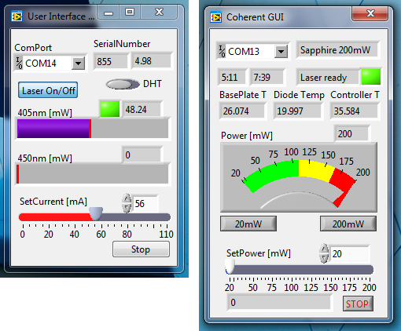

# Five projects inside one github repository:
 * Coherent Sapphire 488mW Laser GUI written in LabView
 * Thorlabs LDC205C Arduino controller code and a LabView GUI _(ldc205c)_
 * Thorlabs LDC500 Arduino controller code #2 and a LabView GUI _(ldc500sh)_
 * A basic temperature reader and LabView GUI _(tds100n)_
 * An artisan DAC + temperature reader and LabVIEW GUI _(dac999)_

## Changelog:
 * Initial release with states.
 * It searches for a config file: _Documents\LabVIEW Data\LaserControlSettings.ini_
 * There is also a build.
 * Create the second arduino driver: ldc500sh
 * Create a basic temperature reader
 * Create a basic dac based on the ldc500sh circuit and code + add the tds100n functionality to it.

# Graphical User Interface in LabView 2014 (now it is updated to 2017).

# Coherent Sapphire 488mW GUI:
[Our team](http://titan.physx.u-szeged.hu/~adoptim/) got a Coherent Sapphire 488nm laser with the LP USB CDRH Driver Unit. This means, it can be only controlled via RS-232. So I wrote a similar GUI as the Arduino LDC205 one, but with advanced internals (STATES). It can be used with any Coherent Lasers as far as I know, because during startup it will check for minimum and maximum laser power values.

# LDC205C: For laser 405nm, for the PWM to LowPass filter edition board.
We have a Thorlabs LDC205C which controls a Nichia 405nm laser diode. To control the diode current, an Arduino's PWM output is driven at 31kHz and RC LowPass filtered. This Arduino UNO R3 and board can be used to create diode currents below 200mA, read back the diode current, and enable/disable laser.
 * Arduino UNO R3 controller for [Thorlabs LDC205](http://www.thorlabs.de/newgrouppage9.cfm?objectgroup_id=10&pn=LDC205C), and LDC500.
   * You can split the MOD IN output to control both lasers with the same modulation. (We don't use both lasers at the same time.)
 * Serial communication examples are used
 * [The String->float conversion](http://forum.arduino.cc/index.php?topic=179666.msg1331654#msg1331654)
 * [LowPass Filter Calculator](http://sim.okawa-denshi.jp/en/PWMtool.php)
 * [Arduino Timer PWM speedup from here](http://playground.arduino.cc/Code/PwmFrequency)
 * [DHTlib, get it from here](http://playground.arduino.cc//Main/DHTLib)

### Sort of documentation:
 * LabView GUI for LDC205 ver 1.0: https://gajdicookbook.wordpress.com/2016/02/07/189/
   * Rewritten to a Cobolt subVI free version. Updated to ver 2.0.
   * The Project and a build is also included.
 * [Controller](https://gajdicookbook.wordpress.com/2015/02/16/arduino-controller-for-thorlabs-ldc200c-series/)

### Start Here for the Arduino Controller LDC205C edition:
 1. Clone the repository to your sketchbook folder.
 2. Connect the BNC connectors:
   * LD REM to pin 13. (Same as the L Led on the board)
   * MOD IN to pin 11. (You can split the output.)
   * CTLOUT1 to pin A0. (first laser)
   * CTLOUT2 to pin A1. (second laser, read only mode)
 3. Calculate the Low-pass filter R&C values from here: http://sim.okawa-denshi.jp/en/PWMtool.php
 4. Burn it to your Arduino UNO.
 5. Optionally connect a DHT22 sensor.

 ### Currently used R&C values:
 * R=5k3 Ohm
 * C=105

### Changelog for the thorlabs-ldc-arduino & GUI:
 * Merged the DHT22 temperature code, from the branch.
 * Added a second _read only_ output for the LDC500 (we got a new laser, which has to be controlled).
   * I updated the serial number to 855 (405+450). And the version to 2.0.
 * De-blobbed the previous LabView GUI, and included in this repository.
 * It searches for a config file: _Documents\LabVIEW Data\LaserControlSettings.ini_
 * There is also a build.
 
## LDC500SH: For laser 637nm, for the PWM to NPN-NPN-LowPass filter edition board.
Recently we installed a 637nm laser into a second laser head which is controlled by a LDC500. To control the diode current an Arduino's PWM output is driven at 31kHZ and converted to 0-10V region. This is then LowPass filtered. This Arduino UNO R3 and board can be used to create diode currents from 0mA to 400mA, read back the diode current, and control a solenoid shutter.
 * Arduino UNO R3 controller for [Thorlabs LDC500](https://www.thorlabs.de/thorproduct.cfm?partnumber=LDC500).
 * [Simulation](http://www.falstad.com/circuit/circuitjs.html?cct=$+1+0.000005+10.20027730826997+29+5+43%0Ar+0+128+48+128+0+10000%0Ar+0+32+0+128+0+10000%0Ar+-160+144+-32+144+0+10000%0Ar+80+112+144+112+0+1000%0Ar+192+112+192+208+0+10000%0Ad+-144+32+-144+80+2+default%0Ad+-128+80+-128+32+2+default%0Ad+-112+32+-112+80+2+default%0Ad+-96+80+-96+32+2+default%0Aw+-144+80+-128+80+0%0Aw+-128+32+-112+32+0%0Aw+-112+80+-96+80+0%0Aw+-96+32+0+32+0%0At+-32+144+0+144+0+1+0.5735729797720364+0.6114101312853065+160%0Ag+0+208+0+272+0%0Aw+0+160+0+192+0%0AR+-144+32+-192+32+0+0+40+12+0+0+0.5%0AR+-160+144+-192+144+4+5+1000+5+0+0+0.7822%0At+48+128+80+128+0+1+-8.636823909212664+0.037837152566076566+100%0Aw+0+32+32+32+0%0Ac+144+112+144+208+0+0.000009999999999999999+6.134599156316293%0Aw+144+112+192+112+0%0Aw+144+208+192+208+0%0Aw+80+208+0+208+0%0Aw+0+192+0+208+0%0A368+32+32+32+-32+0+0%0Aw+80+144+80+208+0%0A368+192+112+224+112+0+0%0A174+32+32+128+48+0+1000+0.5+Resistance%0Aw+80+112+80+48+0%0Aw+80+208+144+208+0%0Ao+27+64+0+4099+10+12.8+0+2+27+3%0Ao+25+64+0+4099+20+12.8+1+2+25+3%0A38+17+3+1+1000+Frequency%0A38+17+5+1+100+Duty%5CsCycle%0A)

### Start Here for the Arduino Controller LDC500 edition:
 1. Clone the repository to your sketchbook folder.
 2. Connect the BNC connectors:
   * OptoRelay for solenoid to pin 13. (Same as the L Led on the board)
   * MOD IN to pin 9. (You can split the output.)
   * CTLOUT1 to pin A5. (first laser)
 3. Burn it to your Arduino UNO.

# Communication with the Controller: 115200 8N1
## Send Command: Carridge Return (\r)
 * l? -> GET laser status (0: disabled, 1: enabled)
 * l[0,1] -> DISABLE/ENABLE laser or shutter
 * i? -> GET laser current (float [mA])
 * p?, pa? -> GET laser power (float [W])
 * slc[0..100] -> SET laser current
 * p[0.0001..0.1] -> SET laser power (only LDC205C)
 * hrs? -> GET uptime in minutes (float)
 * sn? -> GET serial (int)
 * ilk? -> GET interlock state (always 0) (only LDC205C)
 * f? -> GET operation fault state (always 0) (only LDC205C)
 * leds? -> GET led status (1: Power on, 7: Laser on)
 * spv[0...255], d[0...255] -> SET PWM Voltage (only DAC999)
 * gpv?, d? -> GET PWM Voltage (only DAC999, but not working)

 ## Second laser, just readout (only LDC205C)
 * j? -> GET laser current (float [mA])
 * q?, qa? -> GET laser power (float [W])

 ## DHT22 Communication: (only LDC205C)
 * d? -> GET sensor status (0: error, 1: ok)
 * dt? -> GET temperature (float)
 * dh? -> GET humidity (float)

## Dallas W1 Communication (TDS100n & DAC999)
 * t? -> GET temperature (float)

# Manufacturer Documentation
 * Cobolt: http://www.cobolt.se/wp-content/uploads/2016/06/D0106-B_Manual-Cobolt-05-01-Series_June_2016.pdf
   * Look for communication commands.
 * Thorlabs: https://www.thorlabs.com/thorproduct.cfm?partnumber=LDC205C
 * Thorlabs: https://www.thorlabs.com/thorproduct.cfm?partnumber=LDC500
 * Coherent: I have the Operator's Manual on paper.

# Issues with Arduino Leonardo:
 * The board does not handle SerialEvents. [FIX](http://forum.arduino.cc/index.php?topic=150558.msg1131262#msg1131262)
 * [The board does not have Timer2](http://provideyourown.com/2012/arduino-leonardo-versus-uno-whats-new/):
   * Timer4 can be used, but a different board design and pins are needed.

# If you need help with the electronics, contact me.